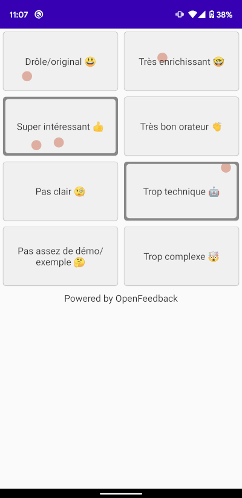

[](https://github.com/paug/openfeedback-android-sdk/actions/workflows/ci.yaml/badge.svg)

# Open-Feedback Kotlin SDK

A Kotlin multiplatform client for Open-Feeedback https://github.com/HugoGresse/open-feedback:



## Usage

The Composable `OpenFeedback` is the entry point to vote on a session. It'll make calls
between the Firebase which host your OpenFeedback instance and your mobile application. It is
mandatory to initialize the `OpenFeedbackFirebaseConfig` class to be able to get the Firebase 
instance which is common for all sessions of your event.

Note that it is mandatory to keep this instance unique in your application because it creates the
`FirebaseApp` instance which is the active connection between your mobile application and the
OpenFeedback Firebase host. Consider to init this configuration in your custom `Application` class.

```kotlin
// In your Application class
initializeOpenFeedback(OpenFeedbackFirebaseConfig(
    context = applicationContext,
    projectId = "<your-firebase-open-feedback-project-id>",
    applicationId = "<your-firebase-open-feedback-app-id>",
    apiKey = "<your-firebase-open-feedback-api-key>",
    databaseUrl = "https://<your-firebase-open-feedback-project-id>.firebaseio.com"
))

// In your Compose screen
OpenFeedback(
    projectId = "<your-open-feedback-project-id>",
    sessionId = "<your-open-feedback-session-id>"
)
```

That's all!

See the [sample-app-android](sample-app/src/main/java/io/openfeedback/android/sample/MainActivity.kt) 
app module if you want to see this implementation in action.

If you are interested to create your own UI, you can use the component `OpenFeedbackLayout`. This
`Composable` takes OpenFeedback Model UI in input and you can use `OpenFeedbackViewModel` in the
viewmodel artifact to get the data from the Firebase host.

## Metrics

If you change Compose contracts or model ui, you can run the following command to check if
Composable or models are still stable:

```shell
./gradlew assembleRelease -PcomposeCompilerReports=true -PcomposeCompilerMetrics=true
```

Then, you can check the `build/compose_compiler` folder where we are using Compose UI to check 
metrics.

## Installation

The SDK is available on mavenCentral:

```kotlin
repositories {
    mavenCentral()
}

val openfeedbackVersion = "1.0.0-alpha.2"
dependencies {
    // Material 3
    implementation("io.openfeedback:openfeedback-m3:$openfeedbackVersion")
}
```
